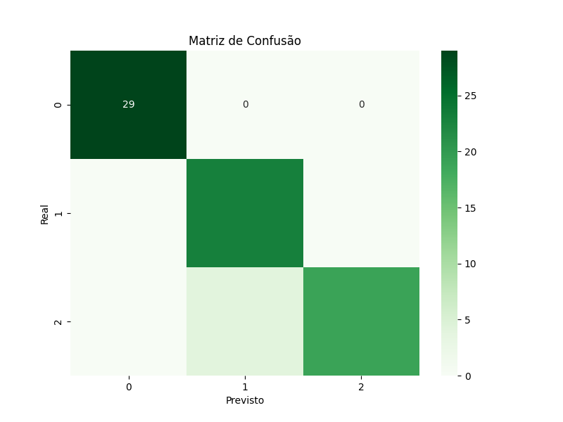

# Classificação de Flores Iris

Este é um projeto simples de classificação de flores usando aprendizado de máquina. Ele utiliza o conjunto de dados Iris (conjunto de dados do scikit-learn) e a biblioteca scikit-learn para criar um modelo de classificação.

## Como Usar

1. Instale as dependências usando `pip`:

```bash
pip3 install -r requirements.txt
```

2. Execute o Script `iris_classification.py` ou use o notebook para executar passo a passo

## Conjunto de Dados

O conjunto de dados Iris contém medidas de comprimento e largura das pétalas e sépalas de três espécies diferentes de flores Iris: Setosa, Versicolor e Virginica. Os dados estão em [data/iris.csv](data).

## Performance

O modelo alcançou uma precisão de X% na classificação das flores Iris. A matriz de confusão abaixo mostra os resultados:



## Contribuições

Contribuições são bem-vindas! Sinta-se à vontade para reportar ou enviar uma solicitação de pull.

## Licença

Este projeto está sob a licença MIT - consulte o arquivo [LICENSE](LICENSE) para obter detalhes.
